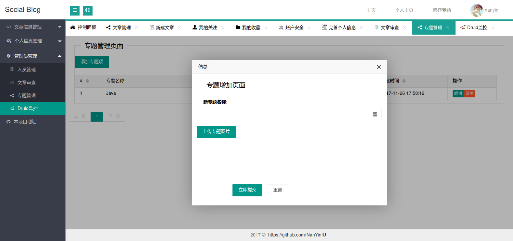

# ExBlog
# 项目介绍
基于ssm框架，使用SpringBoot并使用Shiro权限框架，构成具有前端显示和后端管理的多人博客平台。
#### 后端技术:
技术 | 名称 | 官网
----|------|----
Spring | 容器  | [http://projects.spring.io/spring-framework/](http://projects.spring.io/spring-framework/)
SpringMVC | MVC框架  | [http://docs.spring.io/spring/docs/current/spring-framework-reference/htmlsingle/#mvc](http://docs.spring.io/spring/docs/current/spring-framework-reference/htmlsingle/#mvc)
SpringBoot | 快速开发框架 | [https://github.com/spring-projects/spring-boot](https://github.com/spring-projects/spring-boot)
Apache Shiro | 安全框架  | [http://shiro.apache.org/](http://shiro.apache.org/)
MyBatis | ORM框架  | [http://www.mybatis.org/mybatis-3/zh/index.html](http://www.mybatis.org/mybatis-3/zh/index.html)
MyBatis Generator | 代码生成  | [http://www.mybatis.org/generator/index.html](http://www.mybatis.org/generator/index.html)
Druid | 数据库连接池  | [https://github.com/alibaba/druid](https://github.com/alibaba/druid)
Ehcache | 进程内缓存框架  | [http://www.ehcache.org/](http://www.ehcache.org/)
Log4J | 日志组件  | [http://logging.apache.org/log4j/1.2/](http://logging.apache.org/log4j/1.2/)
Maven | 项目构建管理  | [http://maven.apache.org/](http://maven.apache.org/)
#### 前端技术:
技术 | 名称 | 官网
----|------|----
jQuery | 函式库  | [http://jquery.com/](http://jquery.com/)
Bootstrap | 前端框架  | [http://getbootstrap.com/](http://getbootstrap.com/)
LayUI | 前端框架 | [http://www.layui.com/](http://www.layui.com/)
### 开发环境
-系统:Linux Arch
-IDE:intellJ IDEA
-数据库:Mysql
-应用服务器:tomcat
-数据库客户端:DBeaver
-jdk版本:jdk8
### 预览图
#### 首页

#### 文章列表

#### 个人首页

#### 文章页面

#### 后台-个人文章管理

#### 后台-新建文章-更改文章内容

#### 后台-更新添加关注关系

#### 后台-管理员-专题信息增加

#### 后台-管理员-文章审核

#### 后台-管理员-权限不足

#### 后台-账户安全管理-密码修改

